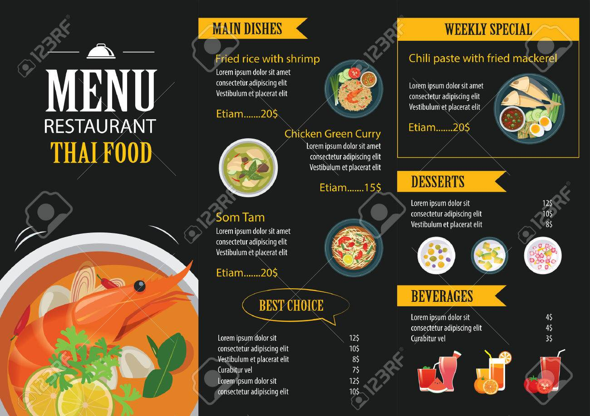

### HTML Warmup Challenges

As a front end developer, it is important to make your HTML structure as clean and as semantic as possible. Creating semantic HTMl not only helps you and your team understand the skeleton of your website, but it also makes your page more accessible as well.  Below you will find a list of review questions on how to structure HTML elements, some exercises using your DevTools, as well as a few layouts to rebuild.

#### Review Questions

Below are a list of questions.  Write the solutions to each question out (yes, with pen and paper).  Practicing writing it out will help you retain the information so that when you need it later, you are more likely to remember!

1. Write an opening and closing article tag. 
  <!-- ```
    <article></article>
  ``` -->
2. How do you link an external stylesheet to your HTML document? Write the element, its attributes,  and indicate where it should be placed in the markup.
  <!-- ```
    <link href="styles.css"  rel="stylesheet" type ="text/css" />
  ``` -->
3. Write an article tag with the class of post-content.
  <!-- ```
    <article class="post-content"></article>
  ``` -->
4. Write an section tag with two classes: day-1 and day-2
  <!-- ```
    <section class="day-1 day-2"></section>
  ``` -->
5. What are two different methods for creating a submit action in an HTML form?
  <!-- ```
    <input type="submit" />
    <button type="submit"></button>
  ``` -->
6. How might you create a navigation bar?  Think about how to make it semantic and remember to include hyperlinks.  It should include hyperlinks to `Home`, `About`, `Bio`, and `Contact` pages. (hint: try drawing out a wireframe of the nav bar before writing the tags)
  <!-- ```
    <nav>
      <ul>
        <li><a href="home">Home</a></li>
        <li><a href="about">About</a></li>
        <li><a href="bio">Bio</a></li>
        <li><a href="contact">Contact</a></li>
      </ul>
    </nav>
  ``` -->
7. Describe an HTML attribute. What is it? How do you write one? Where is it placed?
  <!-- ```
    An attribute can contain additional values that configure HTML elements and adjust their behavior.  They are included in the opening tag of an HTML element. Some examples can include classes, ids, href, src, etc.  Here is an example below:

    

  ``` -->
8. Refactor this line of code to be more accessible: ``
  <!-- ```
    
  ``` -->
9. How do you link your JavaScript code in your HTML file? Write the element and indicate where it should be placed in the markup.

<!-- ```
  <script type="text/javascript" src="main.js"></script>

  This should be placed after the body tag to ensure that the Javascript loads after the DOM has finished loading.
``` -->

#### Practice Your DevTools

Find three different websites that you use frequently and have great user interfaces.  Open your DevTools and examine their site, paying close attention to the use of their HTML elements and overall structure.

1. What is one thing that you really like about the site?  It could be a fancy navigation bar, an easy to use form, a photo gallery, or even the way a blog has been structured.  Take note on how they implemented it using your DevTools.
2. Are there any HTML elements that you aren't familiar with?  Take a moment to google them and write down when they can be useful.
3. What are 2-3 things you would change in their HTML structure to make it more semantic.  Do they use a lot of divs and spans?
4. Find a form on their website and what type of tags they are using.  Are there places that could be improved in their form as well?

#### Practicing Layout Structure and Semantic Elements

Use the following [semantic tags](https://developer.mozilla.org/en-US/docs/Web/HTML/Element) to create a basic structure of the following templates.  Think about which elements are most fitting and how they can be used to create the structure.  It might help to sketch out the boxes and columns (aka draw a quick wireframe) and fill in each of the spots with what tag you want to use.





